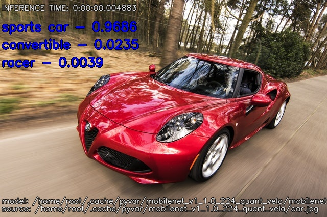

Classification Examples
=======================

The classification examples use a quantized starter model from `TensorFlow Lite`_:

* i.MX 8M Plus:
    * mobilenet_v1_1.0_224_quant.tflite
    * mobilenet_v2_1.0_224_quant.tflite

* i.MX 93:
    * mobilenet_v1_1.0_224_quant_vela.tflite
    * mobilenet_v2_1.0_224_quant_vela.tflite

.. _TensorFlow Lite: https://www.tensorflow.org/lite/guide/hosted_models

Image Classification
--------------------

Run the Image Classification Example on MPlus
~~~~~~~~~~~~~~~~~~~~~~~~~~~~~~~~~~~~~~~~~~~~~

1. Retrieve the example, and execute it on the SoM:

.. code-block:: bash

    curl -LJO https://github.com/varigit/pyvar/raw/master/examples/ml/classification/image_classification_tflite.py

.. code-block:: bash

    python3 image_classification_tflite.py

2. The output should be similar as the one below:

+------------------------------+------------------------------+
| **Image Example**            | **Image Example Classified** |
+==============================+==============================+
| |car-plus|                   | |car-converted-plus|         |
+------------------------------+------------------------------+

.. |car-plus| image:: ../../examples/ml/classification/media/car.jpg
   :width: 100%
   
.. |car-converted-plus| image:: ../../examples/ml/classification/media/car_classified.jpg
   :width: 100%

.. literalinclude:: ../../../examples/ml/classification/image_classification_tflite.py
   :language: python
   :linenos:
   :caption: **Image Classification Example Source Code for MPlus**: `image_classification_tflite.py`_
   :name: Image Classification Example MPlus

.. _image_classification_tflite.py: https://github.com/varigit/pyvar/blob/master/examples/ml/classification/image_classification_tflite.py

|

Run the Image Classification Example on 93
~~~~~~~~~~~~~~~~~~~~~~~~~~~~~~~~~~~~~~~~~~

1. Retrieve the example, and execute it on the SoM:

.. code-block:: bash

    curl -LJO https://github.com/varigit/pyvar/raw/master/examples/ml/classification/image_classification_ethosu.py

.. code-block:: bash

    python3 image_classification_ethosu.py

2. The output should be similar as the one below:

+------------------------------+------------------------------+
| **Image Example**            | **Image Example Classified** |
+==============================+==============================+
| |car-93|                     | |car-converted-93|           |
+------------------------------+------------------------------+

.. |car-93| image:: ../../examples/ml/classification/media/car.jpg
   :width: 100%

.. literalinclude:: ../../../examples/ml/classification/image_classification_ethosu.py
   :language: python
   :linenos:
   :caption: **Image Classification Example Source Code for 93**: `image_classification_ethosu.py`_
   :name: Image Classification Example 93

.. _image_classification_ethosu.py: https://github.com/varigit/pyvar/blob/master/examples/ml/classification/image_classification_ethosu.py

|
|
|

Video Classification
--------------------

Run the Video Classification Example on MPlus
~~~~~~~~~~~~~~~~~~~~~~~~~~~~~~~~~~~~~~~~~~~~~

1. Retrieve the example, and execute it on the SoM:

.. code-block:: bash

    curl -LJO https://github.com/varigit/pyvar/raw/master/examples/ml/classification/video_classification_tflite.py

.. code-block:: bash

    python3 video_classification_tflite.py

2. The output should be similar as the one below:

+------------------------------+------------------------------+
| **Video Example**            | **Video Example Classified** |
+==============================+==============================+
| |street-plus|                | |street-classified-plus|     |
+------------------------------+------------------------------+

.. |street-plus| image:: ../../examples/ml/classification/media/street_video.gif
   :width: 100%

.. |street-classified-plus| image:: ../../examples/ml/classification/media/street_classified_video.gif
   :width: 100%

.. literalinclude:: ../../../examples/ml/classification/video_classification_tflite.py
   :language: python
   :linenos:
   :caption: **Video Classification Example Source code for MPlus**: `video_classification_tflite.py`_
   :name: Video Classification Example MPlus

.. _video_classification_tflite.py: https://github.com/varigit/pyvar/blob/master/examples/ml/classification/video_classification_tflite.py

|

Run the Video Classification Example on 93
~~~~~~~~~~~~~~~~~~~~~~~~~~~~~~~~~~~~~~~~~~

1. Retrieve the example, and execute it on the SoM:

.. code-block:: bash

    curl -LJO https://github.com/varigit/pyvar/raw/master/examples/ml/classification/video_classification_ethosu.py

.. code-block:: bash

    python3 video_classification_ethosu.py

2. The output should be similar as the one below:

+------------------------------+------------------------------+
| **Video Example**            | **Video Example Classified** |
+==============================+==============================+
| |street-93|                  | |street-classified-93|       |
+------------------------------+------------------------------+

.. |street-93| image:: ../../examples/ml/classification/media/street_video.gif
   :width: 100%

.. |street-classified-93| image:: ../../examples/ml/classification/media/street_classified_video_93.gif
   :width: 100%

.. literalinclude:: ../../../examples/ml/classification/video_classification_ethosu.py
   :language: python
   :linenos:
   :caption: **Video Classification Example Source code for 93**: `video_classification_ethosu.py`_
   :name: Video Classification Example 93

.. _video_classification_ethosu.py: https://github.com/varigit/pyvar/blob/master/examples/ml/classification/video_classification_ethosu.py

|
|
|

Real Time Classification
------------------------

Run the Real Time Classification Example
~~~~~~~~~~~~~~~~~~~~~~~~~~~~~~~~~~~~~~~~

1. Retrieve the example, and execute it on the SoM:

.. code-block:: bash

    curl -LJO https://github.com/varigit/pyvar/raw/master/examples/ml/classification/realtime_classification_tflite.py

.. code-block:: bash

    python3 realtime_classification_tflite.py

.. literalinclude:: ../../../examples/ml/classification/realtime_classification_tflite.py
   :language: python
   :linenos:
   :caption: **Real Time Classification Example Source code**: `realtime_classification_tflite.py`_
   :name: Real Time Classification Example

.. _realtime_classification_tflite.py: https://github.com/varigit/pyvar/blob/master/examples/ml/classification/realtime_classification_tflite.py
