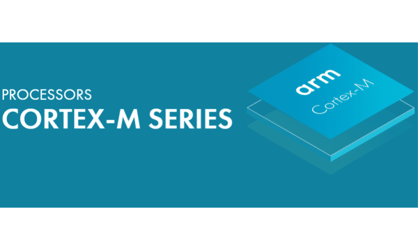

Cortex-M API
====================

|cm-cover|

This API provides a set of functions and methods to help run and communicate
with Cortex-M applications from the Cortex-A side.

.. toctree::
   :caption: Table of Contents
   :maxdepth: 2

   cmapi/pyvar.cm.core.rst
   cmapi/pyvar.cm.utils.rst
