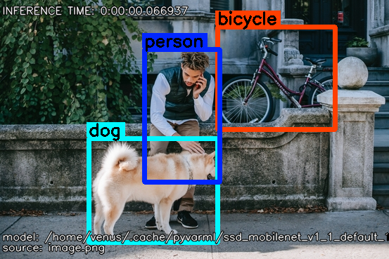

Detection Examples
==================

Image Detection
---------------

1. To create a simple image detection, see the example:

.. code-block:: python

    from pyvarml.engines.tflite import TFLiteInterpreter
    from pyvarml.utils.helper import Label, Images
    from pyvarml.utils.retriever import FTP
    from pyvarml.utils.timer import Timer

    ftp = FTP()
    package_dir = "pyvarml/detection/"
    package_filename = "ssd_mobilenet_v1_1_default_1.zip"

    if ftp.retrieve_package(package_dir, package_filename):
        model_file_path = ftp.model[0]
        label_file_path = ftp.label[0]

    labels = Label(label_file_path, "detection")

    engine = TFLiteInterpreter(model_file_path)

    my_image = Images("image.png")
    my_image.resize(engine_input_details=engine.input_details)

    engine.set_image(my_image.resized)
    engine.run_inference()
    engine.get_detection_result()

    output_image = my_image.put_info(
                            "detection",
                            my_image.image_original,
                            engine.result,
                            labels.list,
                            engine.inference_time,
                            model_file_path,
                            my_image.image)

    my_image.show("Detection Example", output_image)

+------------------------+------------------------+
| **Example**            | **Example Detected**   |
+========================+========================+
| |street|               | |street_detected|      |
+------------------------+------------------------+

.. |street| image:: images/street.png
   :width: 100%

Video Detection
---------------

Real Time Detection
-------------------

