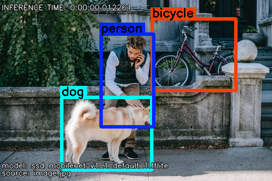

Detection Examples
==================

.. NOTE::
    The detection examples use a starter quantized model from `TensorFlow Lite`_.

.. _TensorFlow Lite: https://www.tensorflow.org/lite/examples/object_detection/overview

Image Detection Example
-----------------------

1. To create a simple image detection, see the example:

.. literalinclude:: examples/detection/image_detection.py
   :language: python
   :linenos:
   :caption: **Source code**: `image_detection.py`_
   :name: Image Detection Example
   :emphasize-lines: 18

.. _image_detection.py: https://github.com/varjig/pyvarml/blob/master/sphinx/examples/detection/image_detection.py

2. See the result:

+--------------------------+--------------------------+
| **Example**              | **Example Detected**     |
+==========================+==========================+
| |street-people|          | |street-people_detected| |
+--------------------------+--------------------------+

.. |street-people| image:: examples/detection/media/street.png
   :width: 100%

Video Detection
---------------

1. To create a simple video detection, see the example:

.. literalinclude:: examples/detection/video_detection.py
   :language: python
   :linenos:
   :caption: **Source code**: `video_detection.py`_
   :name: Video Detection Example
   :emphasize-lines: 18

.. _video_detection.py: https://github.com/varjig/pyvarml/blob/master/sphinx/examples/detection/video_detection.py

2. See the result:

+------------------------+------------------------+
| **Example**            | **Example Detected**   |
+========================+========================+
| |street|               | |street_detected|      |
+------------------------+------------------------+

.. |street| image:: examples/detection/media/street_video.gif
   :width: 100%

.. |street_detected| image:: examples/detection/media/street_detected_video.gif
   :width: 100%

Real Time Detection
-------------------

1. To create a simple real time classification, see the example:

.. literalinclude:: examples/detection/realtime_detection.py
   :language: python
   :linenos:
   :caption: **Source code**: `realtime_detection.py`_
   :name: Real Time Detection Example
   :emphasize-lines: 19

.. _realtime_detection.py: https://github.com/varjig/pyvarml/blob/master/sphinx/examples/detection/realtime_detection.py

User Interface
--------------
