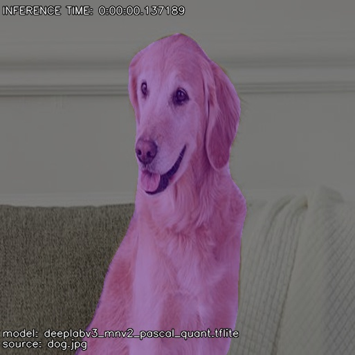

Semantic Segmentation Examples
==============================

.. NOTE::
    The semantic segmentation example uses a starter quantized model from `TensorFlow Lite`_.

.. _TensorFlow Lite: https://github.com/google-coral/test_data

Image Semantic Segmentation Example
-----------------------------------

1. To create a simple image detection, see the example:

.. literalinclude:: examples/segmentation/image_segmentation.py
   :language: python
   :linenos:
   :caption: **Source code**: `image_segmentation.py`_
   :name: Image Semantic Segmentation Example
   :emphasize-lines: 13

.. _image_segmentation.py: https://github.com/varjig/pyvarml/blob/master/sphinx/examples/segmentation/image_segmentation.py

2. See the result:

+--------------------------+--------------------------+
| **Example**              | **Example Segmented**    |
+==========================+==========================+
| |dog|                    | |dog-segmentation|       |
+--------------------------+--------------------------+

